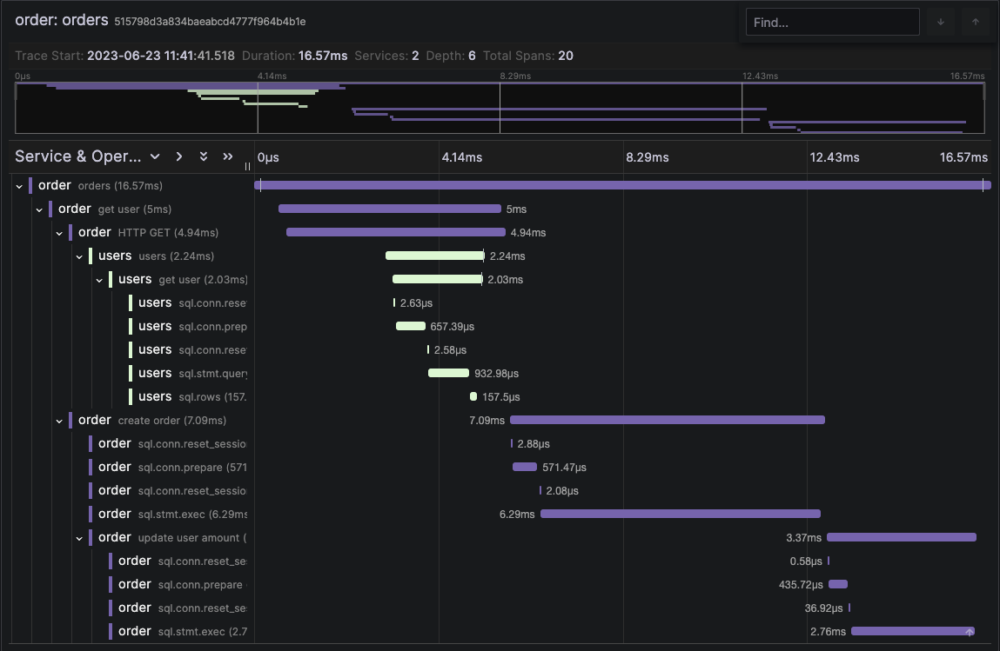
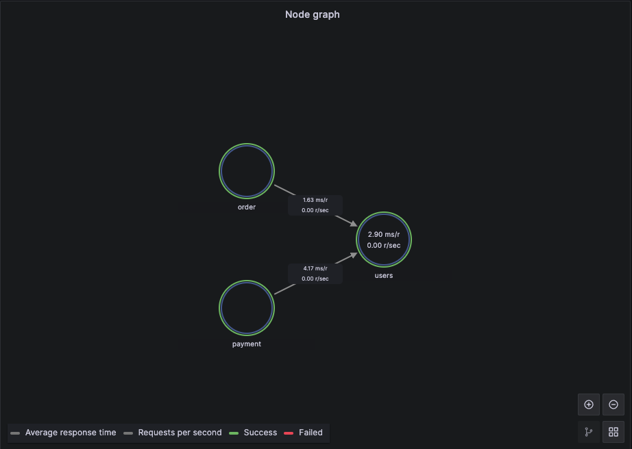

# OpenTelemetry Demo

Based on [SigNoz/distributed-tracing-golang-sample](https://github.com/SigNoz/distributed-tracing-golang-sample).





## Prerequisites

- [OrbStack](https://docs.orbstack.dev/install)

  ```sh
  brew install orbstack
  ```

- Docker CE / Docker Compose / Docker BuildKit

  ```sh
  brew install --cask docker
  ```

- [Kind](https://kind.sigs.k8s.io/docs/user/quick-start/#installation)

  ```sh
  brew install kind
  ```

- [Helm](https://helm.sh/docs/intro/install/)

  ```sh
  brew install helm
  ```

- [Helmfile](https://helmfile.readthedocs.io/en/latest/#installation)

  ```sh
  brew install helmfile
  ```

## Docker Compose

```sh
make docker
docker compose up
```

## Kind cluster

```sh
kind create cluster

# Install metallb
kubectl apply -f https://raw.githubusercontent.com/metallb/metallb/v0.13.10/config/manifests/metallb-native.yaml
kubectl wait --namespace metallb-system --for=condition=ready pod --selector=app=metallb --timeout=90s

# Check Docker Network IPAM config
docker network inspect -f '{{.IPAM.Config}}' kind

# Configure IP address pool
#
# e.g.) .spec.addresses => 198.19.195.240-198.19.195.255
# ❯ docker network inspect -f '{{.IPAM.Config}}' kind
# [{198.19.194.0/23  198.19.194.1 map[]} {fc00:f853:ccd:e793::/64   map[]}]
cat << EOF | kubectl apply -f -
apiVersion: metallb.io/v1beta1
kind: IPAddressPool
metadata:
  name: example
  namespace: metallb-system
spec:
  addresses:
  - 198.19.195.240-198.19.195.255
---
apiVersion: metallb.io/v1beta1
kind: L2Advertisement
metadata:
  name: empty
  namespace: metallb-system
EOF
# Replacing IP address specified in install/helm/otel-demo/examples/values.local.yaml

kind load docker-image ghcr.io/toversus/otel-demo:frontend
kind load docker-image ghcr.io/toversus/otel-demo:backend

helmfile sync --environment local .

# Frontend URL: http://198.19.195.240:8088/

# Grafana URL: http://198.19.195.245
```


```
histogram_quantile(0.95, sum(rate(traces_spanmetrics_latency_bucket[5m])) by (le, service, span_name))
```